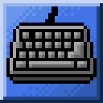
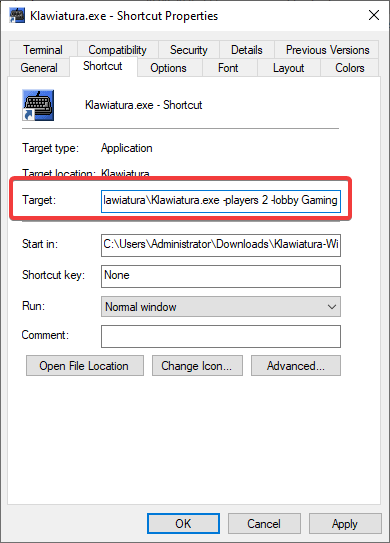

<!-- markdownlint-disable MD033 MD045 -->

# Klawiatura



> [!TIP]
> Check out [the releases](https://github.com/toggins/Klawiatura/releases) to get started.

Mario Forever with rollback netcode.

## Multiplayer

> [!NOTE]
> Klawiatura uses [NutPunch](https://github.com/Schwungus/nutpunch), which relies heavily on Winsock. A cross-platform solution will be implemented later on.

The main kicker of this project. Networking is purely peer-to-peer. By specifying 2+ players with the `-players` command, the game will automatically connect to a matchmaking server and wait for players with a matching lobby ID. You can change your lobby ID with `-lobby`, and specify a custom [nutpuncher](https://github.com/Schwungus/nutpunch) instance with `-ip`.

> [!WARNING]
> Multiplayer with 3+ players is not guaranteed to be stable. It's possible to get a desync error & crash if packets get dropped.

## Launch options

You can adjust the game's settings per session with these launch options:

- `-bypass_shader`: Bypass shader support checking for debugging with RenderDoc.
- `-players <amount>`: Amount of players to assign to the session. (Default: `1`)
- `-ip <ip>`: IP address of the UDP holepuncher server. (Default: [the public NutPunch instance](https://github.com/Schwungus/nutpunch?tab=readme-ov-file#public-instance))
- `-lobby <id>`: The lobby to join after connecting to the server. (Default: `Klawiatura`)

You can add these options to a desktop shortcut:

1. Right-click Klawiatura.exe → Create shortcut.
2. Right-click the shortcut → select "Properties".
3. Append the desired options to the "Target" field (as seen on the screenshot).
4. Click "OK".

Here's how it should look:

<p align="center"></p>

Or you can just use a batch file with the following contents:

```bat
start cmd /c ./Klawiatura.exe -players 2 -lobby Gaming ^& pause
```

## Building from Sources

In order to build this, you will need a C/C++ compiler, [CMake](https://cmake.org/download), and [Python 3.13.x](https://www.python.org/downloads) installed on your computer, as well as the libraries listed below.

### Jinja2 for Python

You will need a system-wide install of the `jinja2` Python module for our dependency [`glad`](https://github.com/Dav1dde/glad) to compile successfully:

```bat
py -m pip install jinja2
```

### [FMOD Engine 2.03.08](https://www.fmod.com/download#fmodengine)

Move everything from `C:\Program Files (x86)\FMOD SoundSystem\FMOD Studio API Windows\api\core`
to `include\fmod\windows` on Windows. This process is also similar enough on
Linux.

### Compiling

Once you have the tools and libraries ready, executing the build is easy as cake:

```bat
cmake -S . -B build -D CMAKE_BUILD_TYPE=Release
cmake --build build --config Release --target ALL_BUILD
```

The resulting binaries should now reside in `build` or `build/Release`, depending on which build system CMake generated configuration for. There will be lots of junk in the directory, but you only need `data`, `fmodL.dll`, and the game executable itself to run Klawiatura successfully.

### Considerations

Listing some of the things we learned the hard way that you should consider:

1. MSVC Debug builds require Debug versions of the Visual C++ libraries to run outside the machine that built the binary. If you really need to test Klawiatura on an external machine with the debug information present, pass `RelWithDebInfo` to `--config` and for `CMAKE_BUILD_TYPE`.
2. If you're building with anything other than MSVC, you'll have to replace `--target ALL_BUILD` with `--target all`. It's actually an MSVC-specific quirk of CMake that the `all` target is named `ALL_BUILD` for whatever reason.

------------

## Footnote

**This project's code is public-domain under the terms of [the Unlicense](https://unlicense.org). Refer to [the copy provided](/UNLICENSE) in this repository for more info.**

All of the assets belong to Nintendo. This is a free, open-source project not created for any sort of profit. We do not condone any commercial use of this project. ~~Don't go buying Klawiatura NFTs anywhere please.~~

Module music provided by [modarchive.org](https://modarchive.org).
