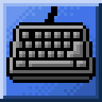

<!-- markdownlint-disable MD028 MD033 MD045 -->

# Klawiatura



> [!TIP]
> Check out [the releases](https://github.com/toggins/Klawiatura/releases/latest) or [play in your browser](https://mario.games.nonk.dev) to get started.

Klawiatura is an enhanced port of Mario Forever 4.0, written in plain C.

### Features

- Native support for Windows, Linux and Emscripten
- A basic mod system with custom worlds and levels
- **Online multiplayer with up to 8 players**

### Changes from Mario Forever 4.0

- Restorations:
  - Original map screens (1.16.1 - 3.0)
  - Checkpoints in main worlds (4.4+)
  - Hammer Bro fights (5.08+)
- Enhancements:
  - Minor graphics and audio fixes
  - Stereo sound panning
  - Coyote time (2 frames) and longer crouch sliding

## Multiplayer

> [!TIP]
> **Discord integration is available for 64-bit binaries.** You can invite other players to your lobbies through Discord, as long as they can connect to the same server as you.

> [!NOTE]
> If you can't see other players in your lobby, check [NutBlast's troubleshooting section](https://nutblast.schwung.us/?tab=readme-ov-file#troubleshooting).

Multiplayer is the main kicker of this project. You can host and find lobbies through NutBlast servers. Lobbies can hold up to 8 players. For custom servers, host a [NutBlaster](https://nutblast.schwung.us) and set your server address to it in the settings.

## Launch options

You can adjust Klawiatura with these launch options:

| Command               | Arguments | Description                                                                                                                                                                                              |
| --------------------- | --------- | -------------------------------------------------------------------------------------------------------------------------------------------------------------------------------------------------------- |
| `-m`, `-mod`          | `<path>`  | Adds a mod folder to load assets from. Prefix with `$` to get a path relative to the game's base folder.<br>If no mods are specified, the game will add `$MarioForever` and `$MarioTogether` by default. |
| `-s`, `-force_shader` |           | Skip checking supported OpenGL extensions. Useful if running under RenderDoc or WSL, where the checks fail even if the game runs fine otherwise.                                                         |

## Building This Yourself

In order to build this, you will need a C/C++ compiler, [CMake](https://cmake.org/download), and [Python 3.13.x](https://www.python.org/downloads) installed on your computer, as well as the libraries listed below. Make sure to download, install, and familiarize yourself with the aforementioned tools before you proceed.

### Jinja2 for Python

You will need a system-wide install of the `jinja2` Python module for our dependency [`glad`](https://github.com/Dav1dde/glad) to compile successfully. On Windows, you can install that with:

```bat
py -m pip install jinja2
```

### [Discord Social SDK 1.9.15332](https://discord.com/developers/social-sdk) (Optional)

> [!NOTE]
> If the SDK is not present, Discord integration will be disabled.

Move the `discord_social_sdk` folder from their ZIP download to `external/discord`.

### Compiling

Once you have the tools and libraries ready, executing the build is simple:

```bat
cmake -S . -B build -D CMAKE_BUILD_TYPE=Release
cmake --build build --config Release
```

The resulting binaries should now reside in `build` or `build/Release`, depending on which build-system CMake generated configuration for. There will be lots of junk in the directory, but you only need `data`, `fmodL.dll`, and the game's executable to run Klawiatura successfully.

### Considerations

Listing some of the things we learned the hard way that you should consider:

1. MSVC Debug builds require Debug versions of the Visual C++ libraries to run outside the machine that built the binary. If you really need to test Klawiatura on an external machine with debug information present, pass `RelWithDebInfo` to `--config` and for `CMAKE_BUILD_TYPE`.
2. The correct "all" target for Visual Studio projects is `ALL_BUILD`, as opposed to `all` in every other CMake generator. Either way, you'll need to build _that_ in order to get `build/data` generated from [`modsrc`](/modsrc).

## Attribution

**This project's source code is public-domain under the terms of [the Unlicense](https://unlicense.org). Refer to [the provided copy](/UNLICENSE) of the license for more info.**

All of the assets belong to Nintendo. This is a free, open-source project not created for any sort of profit. We do not condone any commercial use of this project.

- [SDL](https://github.com/libsdl-org/SDL), [SDL_GameControllerDB](https://github.com/mdqinc/SDL_GameControllerDB), [SDL_mixer](https://github.com/libsdl-org/SDL_mixer) © Sam Lantinga ([Zlib License](https://github.com/libsdl-org/SDL/blob/main/LICENSE.txt))
- [GLAD](https://github.com/Dav1dde/glad) © David Herberth ([MIT License](https://github.com/Dav1dde/glad/blob/glad2/LICENSE))
- [cglm](https://github.com/recp/cglm) © Recep Aslantas ([MIT License](https://github.com/recp/cglm/blob/master/LICENSE))
- [yyjson](https://github.com/ibireme/yyjson) © Yaoyuan Guo ([MIT License](https://github.com/ibireme/yyjson/blob/master/LICENSE))
- [GekkoNet](https://github.com/HeatXD/GekkoNet) © Jamie Meyer ([BSD-2-Clause License](https://github.com/HeatXD/GekkoNet/blob/main/LICENSE))
- [Discord Social SDK](https://discord.com/developers/social-sdk) © Discord

Module music provided by [modarchive.org](https://modarchive.org).
