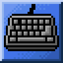

<!-- markdownlint-disable MD028 MD033 MD045 -->

# Klawiatura



> [!TIP]
> Check out [the releases](https://github.com/toggins/Klawiatura/releases/latest) or [play in your browser](https://mario.games.nonk.dev) to get started.

**Klawiatura** (a.k.a. **Mario Together**) is an enhanced port of Mario Forever 4.0, written in plain C.

### Features

- Native support for Windows, Linux and Emscripten
- High framerates
- Basic mod system with custom worlds and levels
- **Online multiplayer with up to 8 players**

### Changes

- Restorations:
  - Original map screens (1.16.1 - 3.0)
  - Checkpoints in main worlds (4.4+)
  - Hammer Bro fights (5.08+)
- Enhancements:
  - Minor graphics and audio fixes
  - Stereo sound panning
  - Improved physics and interactions

## Multiplayer

> [!TIP]
> **Discord integration is available for 64-bit binaries.** You can invite other players to your lobbies through Discord, as long as they can connect to the same server as you.

> [!NOTE]
> If you can't see other players in your lobby, check [NutBlast's troubleshooting section](https://nutblast.schwung.us/?tab=readme-ov-file#troubleshooting).

Multiplayer is the main kicker of this project. You can host and find lobbies through NutBlast servers. Lobbies can hold up to 8 players. For custom servers, host a [NutBlaster](https://nutblast.schwung.us) and set your server address to it in the settings.

> [!IMPORTANT]
> Make sure your game's version and checksum match with other players you want to play with. Your checksum is only affected by mods that have level and/or world files and the order in which they are loaded. Lobbies are filtered based on your game's version and checksum.

## Launch options

You can adjust Klawiatura with these launch options:

| Command               | Arguments | Description                                                                                                                                         |
| --------------------- | --------- | --------------------------------------------------------------------------------------------------------------------------------------------------- |
| `-d`, `-data`         | `<path>`  | Sets the data folder path to load mods from. Note that every folder in this path will be considered a mod and will be loaded in alphabetical order. |
| `-s`, `-force_shader` |           | Skip checking supported OpenGL extensions. Useful if running under RenderDoc or WSL, where the checks fail even if the game runs fine otherwise.    |

## Building This Yourself

In order to build this, you will need a C/C++ compiler and [CMake](https://cmake.org/download) installed on your computer, as well as the libraries listed below. Make sure to download, install, and familiarize yourself with the aforementioned tools before you proceed.

### [Discord Social SDK 1.9.15332](https://discord.com/developers/social-sdk) (Optional)

> [!NOTE]
> If the SDK is not present, Discord integration will be disabled.

Move the `discord_social_sdk` folder from their ZIP download to `external/discord`.

### Compiling

Once you have the tools and libraries ready, executing the build is simple:

```bat
cmake -S . -B build -D CMAKE_BUILD_TYPE=Release
cmake --build build --config Release
```

The resulting binaries should now reside in `build` or `build/Release`, depending on which build-system CMake generated configuration for. There will be junk in the directory, but you only need the following files to run Klawiatura successfully:

- `data`
- `discord_partner_sdk.*` (64-bit only)
- `Klawiatura.*`
- `soundfont.sf2`
- `gamecontrollerdb.txt`

### Considerations

Listing some of the things we learned the hard way that you should consider:

1. On MSVC, only `RelWithDebInfo` and `Release` builds are available. CRT is also statically linked, so checking for memory leaks with [heob](https://github.com/ssbssa/heob) is not possible unless you build with GCC.
2. On Emscripten, `Debug` and `RelWithDebInfo` builds may not work due to yyjson functions generating too many local variables.

## Attribution

**This project's source code is public-domain under the terms of [the Unlicense](https://unlicense.org). Refer to [the provided copy](/UNLICENSE) of the license for more info.**

This is a free, open-source project not created for any sort of profit. We do not condone any commercial use of this project.

Mario, related characters and original assets belong to Nintendo. Mario Forever is an unofficial fangame created by Buziol, and all of the custom assets that form Mario Together, which is built on top of Mario Forever, are created by people listed in the main menu's credits.

Copying, modifying, and/or porting this project does not make the materials mentioned above your work.

- [SDL](https://github.com/libsdl-org/SDL), [SDL_GameControllerDB](https://github.com/mdqinc/SDL_GameControllerDB), [SDL_mixer](https://github.com/libsdl-org/SDL_mixer) © Sam Lantinga ([Zlib License](https://github.com/libsdl-org/SDL/blob/main/LICENSE.txt))
- [GLAD](https://github.com/Dav1dde/glad) © David Herberth ([MIT License](https://github.com/Dav1dde/glad/blob/glad2/LICENSE))
- [cglm](https://github.com/recp/cglm) © Recep Aslantas ([MIT License](https://github.com/recp/cglm/blob/master/LICENSE))
- [yyjson](https://github.com/ibireme/yyjson) © Yaoyuan Guo ([MIT License](https://github.com/ibireme/yyjson/blob/master/LICENSE))
- [GekkoNet](https://github.com/HeatXD/GekkoNet) © Jamie Meyer ([BSD-2-Clause License](https://github.com/HeatXD/GekkoNet/blob/main/LICENSE))
- [Discord Social SDK](https://discord.com/developers/social-sdk) © Discord
- [JSZip](https://github.com/Stuk/jszip) © Stuart Knightley ([MIT License](https://github.com/Stuk/jszip/blob/main/LICENSE.markdown))

Module music provided by [modarchive.org](https://modarchive.org).
