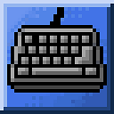

<!-- markdownlint-disable MD028 MD033 MD045 -->

# Klawiatura



> [!TIP]
> Check out [the releases](https://github.com/toggins/Klawiatura/releases) to get started.

Mario Forever with rollback netcode.

## Multiplayer

> [!TIP]
> **Discord integration is here!** You can invite other players to your lobbies through Discord, as long as you're using the public NutPuncher instance; otherwise, the integration is implicitly disabled.

> [!NOTE]
> If you're unable to connect to other players, check [NutPunch's troubleshooting section](https://github.com/Schwungus/nutpunch?tab=readme-ov-file#troubleshooting).

Multiplayer is the main kicker of this project. Networking is purely peer-to-peer. You can host and find lobbies through the public NutPunch server. Lobbies can hold up to 4 players. For custom servers, host a [NutPuncher](https://github.com/Schwungus/nutpunch) server and connect to it using `-ip`.

## Launch options

You can adjust Klawiatura with these launch options:

| Command               | Arguments                         | Description                                                                                                                                                                                       |
| --------------------- | --------------------------------- | ------------------------------------------------------------------------------------------------------------------------------------------------------------------------------------------------- |
| `-s`, `-force_shader` |                                   | Skip checking supported OpenGL extensions. Useful if running under RenderDoc or WSL, where the checks fail even if the game runs fine otherwise.                                                  |
| `-i`, `-skip_intro`   |                                   | Skips the disclaimer screen.                                                                                                                                                                      |
| `-d`, `-data`         | `<path>`                          | Path of the data folder to load assets from.                                                                                                                                                      |
| `-c`, `-config`       | `<path>`                          | Path of the config file. Disables config saving.                                                                                                                                                  |
| `-K`, `-kevin`        |                                   | Awakens Kevin.                                                                                                                                                                                    |
| `-F`, `-fred`         |                                   | Awakens Fred.                                                                                                                                                                                     |
| `-a`, `-ip`           | `<ip>`                            | IP address of the [NutPuncher](https://github.com/Schwungus/nutpunch) server. (Default: [the public NutPunch instance](https://github.com/Schwungus/nutpunch?tab=readme-ov-file#public-instance)) |
| `-l`, `-level`        | `<name>`                          | Level file to load. Quickstarts the game in singleplayer.                                                                                                                                         |
| `-S`, `-string`       | `<string>`                        | Converts a 16-character string into `int32_t[4]` and closes the application. Only used for debugging and level editing.                                                                           |
| `-h`, `-host`         | `<id> <public> <players> <level>` | Hosts a lobby on launch.                                                                                                                                                                          |
| `-j`, `-join`         | `<id>`                            | Joins the specified lobby on launch.                                                                                                                                                              |

You can add these options to a desktop shortcut:

1. Right-click Klawiatura.exe → Create shortcut.
2. Right-click the shortcut → select "Properties".
3. Append the desired options to the "Target" field (as seen on the screenshot).
4. Click "OK".

Here's how it should look:

<p align="center"></p>

Or you can just use a batch file with the following contents:

```bat
start cmd /c ./Klawiatura.exe <your launch options here> ^& pause
```

## Building This Yourself

In order to build this, you will need a C/C++ compiler, [CMake](https://cmake.org/download), and [Python 3.13.x](https://www.python.org/downloads) installed on your computer, as well as the libraries listed below. Make sure to download, install, and familiarize yourself with the aforementioned tools before you proceed.

### Jinja2 for Python

You will need a system-wide install of the `jinja2` Python module for our dependency [`glad`](https://github.com/Dav1dde/glad) to compile successfully. On Windows, you can install that with:

```bat
py -m pip install jinja2
```

### [FMOD Engine 2.03.11](https://www.fmod.com/download#fmodengine)

**Windows**: move everything in `C:\Program Files (x86)\FMOD SoundSystem\FMOD Studio API Windows\api\core` to `external\fmod\windows`.

**Linux**: move everything in `fmodstudioapi20311linux` to `external/fmod/linux`.

### [Discord Social SDK 1.7.13152](https://discord.com/developers/social-sdk) (Optional)

> [!NOTE]
> If the SDK is not present or the build environment is 32-bit, most of the functions in `K_discord.c` will become no-ops.

Move the `discord_social_sdk` folder from their ZIP download to `external/discord`.

### Compiling

Once you have the tools and libraries ready, executing the build is simple:

```bat
cmake -S . -B build -D CMAKE_BUILD_TYPE=Release
cmake --build build --config Release
```

The resulting binaries should now reside in `build` or `build/Release`, depending on which build-system CMake generated configuration for. There will be lots of junk in the directory, but you only need `data`, `fmodL.dll`, and the game's executable to run Klawiatura successfully.

### Considerations

Listing some of the things we learned the hard way that you should consider:

1. MSVC Debug builds require Debug versions of the Visual C++ libraries to run outside the machine that built the binary. If you really need to test Klawiatura on an external machine with debug information present, pass `RelWithDebInfo` to `--config` and for `CMAKE_BUILD_TYPE`.
2. The correct "all" target for Visual Studio projects is `ALL_BUILD`, as opposed to `all` in every other CMake generator. Either way, you'll need to build _that_ in order to get `build/data` generated from [`modsrc`](/modsrc).

## Attribution

**This project's source code is public-domain under the terms of [the Unlicense](https://unlicense.org). Refer to [the provided copy](/UNLICENSE) of the license for more info.**

All of the assets belong to Nintendo. This is a free, open-source project not created for any sort of profit. We do not condone any commercial use of this project.

- [SDL](https://github.com/libsdl-org/SDL), [SDL_image](https://github.com/libsdl-org/SDL_image), [SDL_GameControllerDB](https://github.com/mdqinc/SDL_GameControllerDB) © Sam Lantinga ([Zlib License](https://github.com/libsdl-org/SDL_mixer/blob/main/LICENSE.txt))
- [GLAD](https://github.com/Dav1dde/glad) © David Herberth ([MIT License](https://github.com/Dav1dde/glad/blob/glad2/LICENSE)). Currently used for OpenGL.
- [cglm](https://github.com/recp/cglm) © Recep Aslantas ([MIT License](https://github.com/recp/cglm/blob/master/LICENSE))
- [yyjson](https://github.com/ibireme/yyjson) © Yaoyuan Guo ([MIT License](https://github.com/ibireme/yyjson/blob/master/LICENSE))
- [GekkoNet](https://github.com/HeatXD/GekkoNet) © Jamie Meyer ([BSD-2-Clause License](https://github.com/HeatXD/GekkoNet/blob/main/LICENSE))
- [FMOD Core](https://www.fmod.com/) © Firelight Technologies Pty Ltd. ([FMOD License](https://www.fmod.com/licensing)) Currently used for audio.
- [Discord Social SDK](https://discord.com/developers/social-sdk) © Discord

Module music provided by [modarchive.org](https://modarchive.org).
